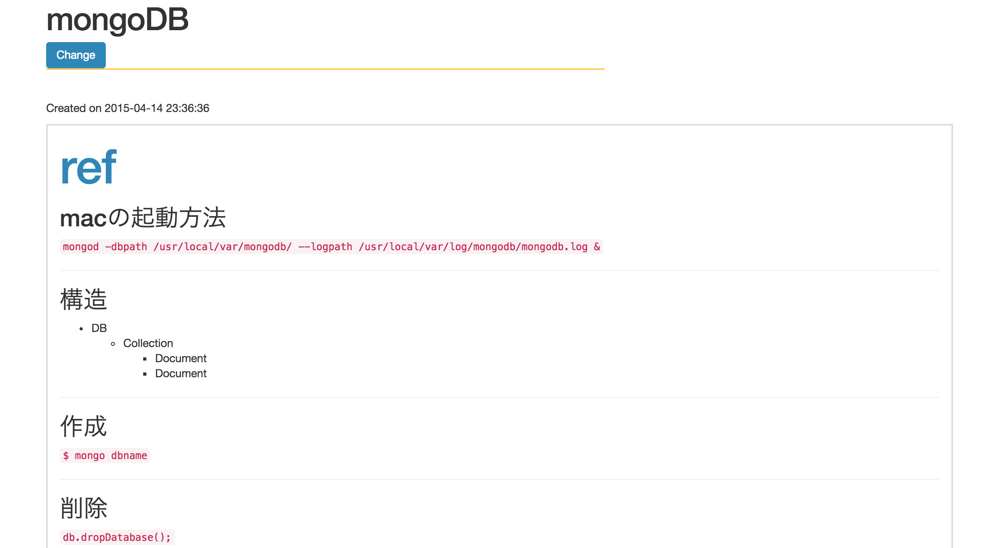

[](https://travis-ci.org/abouthiroppy/myVocabs)

# Markdown-memo(for my own use)

# """"Unfinished""""
# UI is tekio~~~(><)

## Install and Setting

### install
- `mongoDB`
- `nodejs`
- `npm`
- `pm2` or `forever`

---


### Setting
```
$ git clone https://github.com/abouthiroppy/myVocabs
$ npm install
$ bower install
$ grunt build  
$ cd dist/server  
_if you use pm2_
$ NODE_ENV=production PORT=xxxx pm2 start app.js  
```
---

## Screen shot(in development)
### word list


### word page


## Library
- generator-angular-fullstack
- bootflat
- moment
- ng-table
- Selecter
- marked
- mousetrap

## License
MIT
